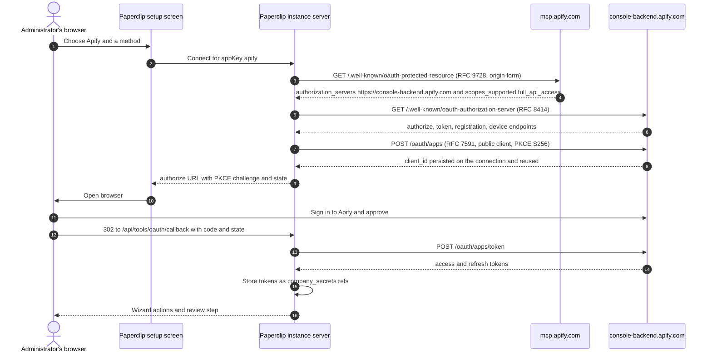

# Apify connection

Shipped shape: one curated `AppDefinition`
(`packages/shared/src/app-definitions/apify.json`) pointing directly at Apify's
own hosted remote MCP server. No shim, no wrapper, no plugin.

The two things that matter: **this is a single hosted endpoint, not an
actor-scoped connection**, and **running an Actor spends real plan usage**.

- Verified against live metadata on 2026-09-30.
- Ledger row: `packages/shared/src/self-serve-mcp-research.json`, wave 3,
  `status: self_serve`, `authMode: dcr_or_api_key`, `riskTier: S2`.

## What ships

| | `mcp-oauth` | `mcp-api-key` |
| --- | --- | --- |
| Label | Sign in with Apify | Use an API key |
| Transport | `mcp_remote` | `mcp_remote` |
| Endpoint | `https://mcp.apify.com/?telemetry-enabled=false` | `https://mcp.apify.com/?telemetry-enabled=false` |
| Auth | `oauth` | `api_key` |
| `ownershipModes` | `["dcr"]` | `["customer"]` |
| `defaults.scopesHint` | `["full_api_access"]` | none |
| `riskTier` | `S2` | `S2` |
| `requiredResourceFilters` | `["account", "actor", "dataset"]` | `["account", "actor", "dataset"]` |
| Credential | none | `authorization`, `password`, required, `secret: true`, label `Apify API key`, placeholder `Paste your Apify API token` |
| `keyPlacement` | — | header `Authorization`, prefix `Bearer ` |

App-level: `slug: apify`, `categories: ["developer"]`,
`redirectConstraints: "https-or-loopback-http"`,
`docsUrl: https://docs.apify.com/platform/integrations/mcp`,
`urlPatterns: ["https://mcp.apify.com/*"]`. Artwork: `/brands/apps/apify.svg`,
used on both themes. `consoleLinks` point at
`https://console.apify.com/account/integrations` and
`https://console.apify.com/actors`.

Both methods carry the same three warnings: an Apify API token (Apify Console →
Integrations) or browser sign-in is required; **Apify's own MCP telemetry is on
by default and this connection opts out**; and **running an Actor spends the
account's plan usage and can incur charges on metered plans.**

Two endpoint details to preserve:

- **The trailing slash stays.** `protectedResourceMetadataUrls` reads only the
  path, so `https://mcp.apify.com/` derives exactly one RFC 9728 candidate — the
  origin form, which is the only form Apify serves. Changing the endpoint to
  `https://mcp.apify.com/mcp` does not add a wasted probe; it **breaks the
  connection**. See Discovery below.
- **The `?telemetry-enabled=false` query is deliberate.** Apify's telemetry is
  opt-out, and this is its documented opt-out parameter. It does not disturb
  discovery or the RFC 8707 `resource`, both of which read only the path.
  Apify's documentation writes the same opt-out URL without the trailing slash;
  both forms reach the same endpoint.

## Single hosted endpoint, not actor-scoped

State this plainly, because it is the question an operator actually asks:

**Apify ships one hosted MCP endpoint. It is not one endpoint per Actor, and
Paperclip's definition is not actor-scoped.**

- Both methods point at the same `https://mcp.apify.com/?telemetry-enabled=false`
  — same endpoint, plus Apify's telemetry opt-out.
- Apify selects which tools are exposed through a `tools` **query parameter** on
  the server URL, for example `https://mcp.apify.com?tools=actors,docs,apify/rag-web-browser`.
- Any Actor can additionally be run on demand by name through the `call-actor`
  tool, resolved from `search-actors` / `fetch-actor-details`. That call runs
  against **the authenticated Apify account**.
- Paperclip's shipped definition declares **no `tools` parameter and no field for
  one**, so Apify's documented default set applies: the `actors` and `docs`
  categories, the `apify/rag-web-browser` and `apify/web-fetch` Actors, and
  `report-problem`.

Consequences for an operator:

1. **The account is the boundary Paperclip can review.** `requiredResourceFilters`
   names `account`, `actor`, and `dataset`, but those are reviewed policy
   metadata, not enforcement. The connection can reach every Actor, dataset, and
   key-value store the credential's account can reach. Use an Apify account or
   token scoped as narrowly as your process allows, and do not point this
   connection at a production account with valuable datasets.
2. **Narrow the Actor surface in Apify, not in Paperclip.** Paperclip's action
   policy can turn `call-actor` to **Ask first** or **Off**, which is the useful
   control, but it cannot express "only these three Actors". Apify's `tools`
   parameter is the mechanism for that, and this definition does not expose it.
3. **Do not expect an actor allowlist.** If you need one today, connect Apify
   generically from **Connect your own MCP server** with an explicit
   `?tools=` URL. See [Connecting any remote MCP server](./GENERIC-REMOTE-MCP.md).

Apify deliberately excludes two Actor classes from search and execution:
**full-permission Actors**, because running one is a decision an approver makes
personally, and **rental Actors**, because their subscription model does not fit
on-demand execution. That is a useful provider-side control, not a Paperclip one.

## Connect and use

- **Sign in with Apify.** Sign in so runs use the account's Actors, datasets, and
  plan usage.
- **Use an API key.** Open Apify Console → Integrations, copy an API token, and
  paste it into Paperclip. Runs made through this connection spend that account's
  plan usage. Never put the token in connection config, a URL, or an agent prompt.

Paperclip records the intended account boundary; Apify enforces what the
signed-in account can actually run.

Setup is **Access → Connect**. Successful authentication and catalog discovery
complete setup.

## Service involvement

Apify hosts the MCP resource at `mcp.apify.com` and its authorization server at
the separate host `console-backend.apify.com`, with the human-facing authorize
page on `console.apify.com`. Paperclip discovers the endpoints, registers its own
client through RFC 7591 DCR, stores returned tokens as instance-vault secret
references, and handles the callback at `/api/tools/oauth/callback`. **Neither
Paperclip ID nor Paperclip Connect participates.** DCR is instance-local; cloud
and self-hosted use the same path.

Exact endpoints, verified 2026-09-30:

| Role | Endpoint |
| --- | --- |
| MCP server | `https://mcp.apify.com/` |
| Protected-resource metadata (RFC 9728, origin form) | `https://mcp.apify.com/.well-known/oauth-protected-resource` |
| AS metadata (RFC 8414) | `https://mcp.apify.com/.well-known/oauth-authorization-server` |
| Authorize | `https://console.apify.com/authorize/oauth` |
| Token (exchange + refresh) | `https://console-backend.apify.com/oauth/apps/token` |
| Registration (RFC 7591 DCR) | `https://console-backend.apify.com/oauth/apps` |
| Device authorization | `https://console-backend.apify.com/oauth/apps/devices` |
| Paperclip callback | `/api/tools/oauth/callback` |

Observed metadata facts: `issuer: https://console-backend.apify.com`,
`scopes_supported: ["full_api_access"]`, `code_challenge_methods_supported: ["S256"]`,
`token_endpoint_auth_methods_supported: ["client_secret_basic", "client_secret_post", "none", "private_key_jwt"]`
with `token_endpoint_auth_signing_alg_values_supported: ["RS256","RS384","RS512"]`,
`client_id_metadata_document_supported: true`, and
`authorization_response_iss_parameter_supported: true`. The protected-resource
document reports `resource: "https://mcp.apify.com"` and points at
`https://console-backend.apify.com`.

The single reviewed scope `full_api_access` matches what Apify's live metadata
advertises on both documents. It is a **full-access** scope: name it in your risk
review rather than treating it as narrow.

### Discovery, and one thing to preserve

`GET https://mcp.apify.com/` returns `401` **with no `WWW-Authenticate` header**.
Its plain-text body explains that a token must be passed as
`Authorization: Bearer <token>`. So `challengeOAuthHints` yields nothing here
either.

Discovery still works, because Apify serves RFC 9728 protected-resource metadata
at the **origin form only**. Measured 2026-09-30:

| Request | Result |
| --- | --- |
| `GET https://mcp.apify.com/` | `401`, no `WWW-Authenticate` |
| `GET https://mcp.apify.com/mcp` | **`404`** |
| `GET https://mcp.apify.com/.well-known/oauth-protected-resource` | `200` |
| `GET https://mcp.apify.com/.well-known/oauth-protected-resource/mcp` | `404` |
| `GET https://mcp.apify.com/?telemetry-enabled=false` | `401` (live endpoint, same challenge as the bare root) |

**This is why the manifest's `serverUrl` path is `/` and must stay `/`.**
`protectedResourceMetadataUrls` strips trailing slashes, so an empty path means
only the origin-form candidate is derived, and that is the candidate Apify
serves. Pointing the endpoint at `https://mcp.apify.com/mcp` would derive the
path-aware candidate first, which answers `404`, and the connection would then
have no authorization server to complete a login. Do not "tidy" the URL without
re-running the preflight — the cost is a broken connection, not a wasted probe.

Unlike Intercom, Apify needs no `metadataUrl` hint, and the shipped definition
correctly does not declare one.

### Apify's own MCP telemetry is on by default, and this connection opts out

Apify's documentation states that its MCP server collects telemetry about tool
calls and MCP clients, that participation is optional, that what it collects is
tool usage (calls, success/failure, duration) plus MCP client attributes, and —
the part that matters for a default — "By default, telemetry is *enabled* for all
tool calls." The documented remote opt-out is the `telemetry-enabled=false`
**query parameter** on the server URL.

**Both methods now ship `https://mcp.apify.com/?telemetry-enabled=false`**, and
both carry a warning naming the collection and the opt-out. An earlier revision
of this connector shipped the bare root URL and this document claimed the
parameter "cannot be expressed" in the definition. That was wrong: the parameter
is a query string, it passes `parseRemoteHttpEndpoint` and the egress guard, and
it survives discovery untouched because every URL helper in the chain reads only
the path. The claim is removed rather than softened.

This is a third-party MCP server's own telemetry, distinct from Paperclip
Telemetry, the OpenTelemetry trace path, and the local run log — see `AGENTS.md`
for the three data paths and their review levels. It is Apify's choice to collect
and its own opt-out that governs it. Nothing in Paperclip's telemetry setting
controls it; the query parameter on this connection is Apify's opt-out, and the
manifest says so where the operator will see it. If a future Paperclip revision
needs a different trade-off, the parameter is right there in
`scripts/ingest-app-definitions.mjs` (`apifyServerUrl`), one constant for both
methods.

## Capabilities

Apify's documented tool set, with the default-enabled ones marked. Nothing here
is pinned by Paperclip's definition; this is what Apify serves for the default
endpoint.

| Tool | Default | Class |
| --- | --- | --- |
| `search-actors` | yes | read |
| `fetch-actor-details` | yes | read |
| `call-actor` | yes | **write — runs an Actor, spends plan usage** |
| `apify/rag-web-browser` | yes | write — an Actor |
| `apify/web-fetch` | yes | write — an Actor |
| `search-apify-docs` | yes | read |
| `fetch-apify-docs` | yes | read |
| `report-problem` | yes | write |
| `get-actor-run`, `get-actor-run-list`, `get-actor-run-log`, `abort-actor-run` | added with Actor tools | read, and `abort-actor-run` is destructive |
| `get-dataset`, `get-dataset-items`, `get-dataset-schema`, `get-dataset-list` | no | read |
| `get-key-value-store`, `-keys`, `-record`, `-list` | no | read |
| `get-actor-task`, `create-actor-task`, `update-actor-task` | no | read, write |
| `publish-actor-task`, `unpublish-actor-task` | no | write |
| `create-schedule`, `get-schedule`, `update-schedule`, `delete-schedule` | no | read, write, destructive |

Two behavioral details worth knowing before you trust a result:

- **`call-actor` returns run status and storage IDs, not results.** To read the
  output, call `get-dataset-items` with the `datasetId` from the run. It accepts
  `limit`, `offset`, and field filtering.
- **`call-actor` waits.** `waitSecs` is 0-45, default 30. Loading any Actor tool
  also adds `get-actor-run`, `get-dataset-items`, `get-key-value-store-record`,
  and `abort-actor-run` to the catalog, even if you did not select them.

Also note: Apify supports **agentic payments** — AGI, Skyfire, and direct x402 —
which let an agent pay for Actor runs without an Apify API token. A connection
authorized for this connector is not the only path by which an agent could spend
on Apify.

Apify rate-limits the MCP server at **30 requests per second per user** across all
operations, returning `429` above that.

## Governance defaults

`riskTier: S2` on both methods. Every active action starts **Allowed**, including
`call-actor` and both default Actor tools. On an S2 provider that means an agent
can spend plan usage without approval on first connect.

Before granting a connection broadly:

- Set `call-actor` and the Actor tools to **Ask first** or **Off**.
- `abort-actor-run` is destructive and also auto-added; review it explicitly.
- Point the connection at a scoped Apify account, not a production one.

Paperclip applies no provider-specific rate limit for Apify. Use Apify plan limits
and Apify's own 30 req/s cap.

## Recovery

- `401` or "you need to pass your Apify API token": the credential did not reach
  the server. Confirm the connection's credential ref, then reconnect. Verify the
  token is current in Apify Console → Integrations.
- Tools list but Actor runs fail on quota: the account is out of plan usage. This
  is an Apify billing state, not a Paperclip fault.
- Cancelled consent: start the connect flow again.
- Catalog drift after an Apify default-set change: refresh actions. New tools are
  Allowed under the existing access rules, so re-review after each refresh on this
  connection.

## Validation boundary

Deterministic coverage exists for the catalog contract, URL recognition for both
the trailing-slash and `/sse` forms, both method shapes, the `Authorization:
Bearer` placement, the `full_api_access` scope, the resource filters, and the
plan-usage warning text (`packages/shared/src/app-definitions.test.ts`).

Explicitly **UNVERIFIED**, grounded in Apify's documentation rather than a live
account:

- **Full lifecycle proof**: consent, catalog, one safe read, refresh, revoke,
  secret scan. No client was registered during research, per the playbook.
- **Whether DCR registration against `https://console-backend.apify.com/oauth/apps`
  yields a usable public client in practice.** The advertised
  `token_endpoint_auth_methods_supported` includes `none`, so a public client is
  expected; `private_key_jwt` and CIMD support are also advertised, and which tier
  Apify actually honours for a dynamically registered client is untested.
- **The exact default tool list in a connected catalog.** It is Apify's to change
  and this definition does not pin it.
- **Actual plan pricing and quota headroom** for any account. Account-specific,
  and Paperclip encodes none of it.