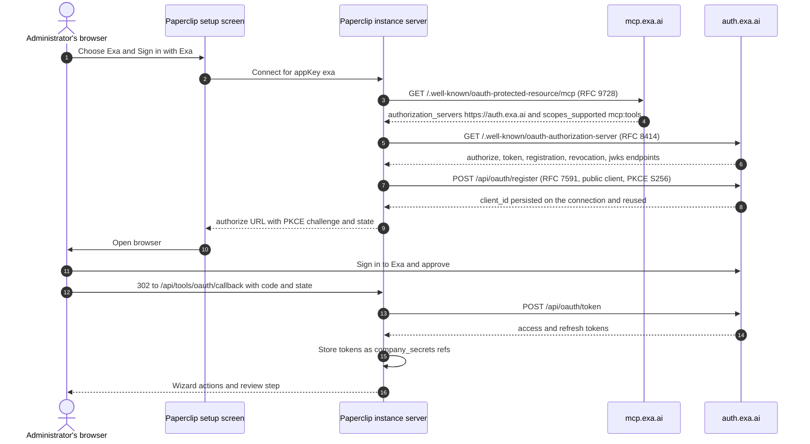

# Exa connection

Shipped shape: one curated `AppDefinition`
(`packages/shared/src/app-definitions/exa.json`) pointing directly at Exa's own
hosted remote MCP server. No shim, no wrapper, no plugin.

Exa is the lowest-risk connector in this group: S1, read-only web search and page
fetch, no customer data. The two things an operator must actually read are the
**billed `agent_run` tool** and the fact that **only an authenticated connection
gets Exa Agent at all**.

- Verified against live metadata on 2026-09-30.
- Ledger row: `packages/shared/src/self-serve-mcp-research.json`, wave 1,
  `status: self_serve`, `authMode: dcr_or_api_key`, `riskTier: S1`.

## What ships

| | `mcp-oauth` | `mcp-api-key` |
| --- | --- | --- |
| Label | Sign in with Exa | Use an API key |
| Transport | `mcp_remote` | `mcp_remote` |
| Endpoint | `https://mcp.exa.ai/mcp?login` | `https://mcp.exa.ai/mcp` |
| Auth | `oauth` | `api_key` |
| `ownershipModes` | `["dcr"]` | `["customer"]` |
| `defaults.scopesHint` | `["mcp:tools"]` | none |
| `riskTier` | `S1` | `S1` |
| `requiredResourceFilters` | none declared | none declared |
| Credential | none | `authorization`, `password`, required, `secret: true`, label `Exa API key`, placeholder `Paste your Exa API key` |
| `keyPlacement` | — | header `x-api-key`, no prefix |

**The two endpoints differ, and the difference is not cosmetic.** Exa documents
three authentication modes with three URLs: keyless is the bare
`https://mcp.exa.ai/mcp`, an API key is the bare URL plus the `x-api-key` header,
and interactive OAuth is the bare URL **plus `?login`**. The OAuth method
therefore ships `?login` and the API-key method does not — that is Exa's own
instruction, not a Paperclip preference. `?login` does not disturb anything
downstream: `parseRemoteHttpEndpoint` accepts the query, and both
`protectedResourceMetadataUrls` and `canonicalResourceIndicator` read only the
path, so discovery still probes `https://mcp.exa.ai/.well-known/oauth-protected-resource/mcp`
and the RFC 8707 `resource` stays `https://mcp.exa.ai/mcp`.

App-level: `slug: exa`, `categories: ["ai"]`,
`redirectConstraints: "https-or-loopback-http"`,
`docsUrl: https://exa.ai/docs/get-started/exa-mcp`,
`urlPatterns: ["https://mcp.exa.ai/*"]`. Artwork: `/brands/apps/exa.svg` with
`/brands/apps/exa-dark.svg` for the dark frame.

**The key placement is deliberate and provider-specific.** Exa's REST API accepts
`Authorization: Bearer $EXA_API_KEY`, but its hosted MCP server documents
`x-api-key`. The shared default placement would be wrong here, so
`apiKeySpec.exa` in `scripts/ingest-app-definitions.mjs` overrides it. Do not
"correct" it to the REST API's header.

## Connect and use

Pick a method explicitly; Paperclip does not fall back from one to the other.

- **Sign in with Exa.** Sign in to Exa in the browser so searches use your team's
  rate limits instead of the free anonymous profile, and so Exa Agent is
  available.
- **Use an API key.** Open [Exa API keys](https://dashboard.exa.ai/api-keys), copy
  a key, and paste it into Paperclip. A key raises rate limits and enables Exa
  Agent; the keyless server still works without one. Never put the key in
  connection config, a URL, or an agent prompt.

### Measured: two tools anonymously, three authenticated

Probes on 2026-09-30, all against `initialize` then `tools/list` on the same
endpoint. This is the difference between the anonymous profile and an
authenticated one, and it is why the OAuth method carries `?login`:

| Request | Result |
| --- | --- |
| `POST https://mcp.exa.ai/mcp`, no credential | `200`; server `exa-search-server` (`Exa`, `3.2.1`); tools `web_search_exa`, `web_fetch_exa` |
| `POST https://mcp.exa.ai/mcp`, bearer token | `200`; tools `web_search_exa`, `web_fetch_exa`, **`agent_run`** |
| `POST https://mcp.exa.ai/mcp?login`, no credential | `401` with `WWW-Authenticate: Bearer resource_metadata="https://mcp.exa.ai/.well-known/oauth-protected-resource/mcp"` and body `Authentication required. Use OAuth or provide an API key.` |
| `POST https://auth.exa.ai/api/oauth/register` (RFC 7591, public client, PKCE S256) | `201` with `client_id`, `token_endpoint_auth_method: "none"` |

Two consequences:

1. **`?login` is the interactive switch, and it is enforced.** The bare URL serves
   the anonymous profile, so an OAuth method that pointed at the bare URL would
   authenticate into the *wrong* profile rather than fail loudly.
2. **Exa Agent requires OAuth *or* an API key.** Exa's own docs: "`agent_run`
   cannot use the free rate limits, so it only appears once you connect with
   `?login` or configure an API key", and "Agent runs are usage-based, so
   `agent_run` requires OAuth or an API key". An operator reading "an API key is
   required for Exa Agent" would skip sign-in unnecessarily; an operator reading
   nothing would never learn why `agent_run` is missing. Both methods say it
   plainly now.

Setup is **Access → Connect**. Successful authentication and catalog discovery
complete setup.

## Service involvement

Exa hosts the MCP resource at `mcp.exa.ai` and its authorization server at the
separate host `auth.exa.ai`. Paperclip discovers both, registers its own client
through RFC 7591 DCR, stores returned tokens as instance-vault secret references,
and handles the callback at `/api/tools/oauth/callback`. **Neither Paperclip ID
nor Paperclip Connect participates.** DCR is instance-local; cloud and self-hosted
use the same path.



Exact endpoints, verified 2026-09-30:

| Role | Endpoint |
| --- | --- |
| MCP server | `https://mcp.exa.ai/mcp` |
| Protected-resource metadata (RFC 9728) | `https://mcp.exa.ai/.well-known/oauth-protected-resource/mcp` |
| AS metadata (RFC 8414) | `https://auth.exa.ai/.well-known/oauth-authorization-server` |
| Authorize | `https://auth.exa.ai/oauth/authorize` |
| Token (exchange + refresh) | `https://auth.exa.ai/api/oauth/token` |
| Registration (RFC 7591 DCR) | `https://auth.exa.ai/api/oauth/register` |
| Revoke | `https://auth.exa.ai/api/oauth/revoke` |
| JWKS | `https://auth.exa.ai/api/oauth/jwks` |
| Paperclip callback | `/api/tools/oauth/callback` |

Note that `https://mcp.exa.ai/.well-known/oauth-authorization-server` returns
`404`. Exa's authorization server is on a different host, and discovery finds it
through the RFC 9728 document. That is why this definition ships no
`metadataUrl`.

The RFC 7591 registration in the diagram is not aspirational: it was measured.
`POST https://auth.exa.ai/api/oauth/register` with a public-client PKCE S256 body
answered `201` and returned `client_id`,
`client_id_issued_at`, and `token_endpoint_auth_method: "none"` on 2026-09-30.
That client ID was thrown away — it was a probe, not a usable Paperclip
registration, and the playbook says not to leave real registrations lying around
— but it proves Exa accepts dynamic registration where Figma refuses it.

Observed metadata facts: `issuer: https://auth.exa.ai`,
`scopes_supported: ["mcp:tools"]`, `token_endpoint_auth_methods_supported: ["none"]`
— a **public** client, so Paperclip expects no client secret —
`code_challenge_methods_supported: ["S256"]`,
`grant_types_supported: ["authorization_code", "refresh_token", "urn:ietf:params:oauth:grant-type:jwt-bearer"]`,
and `client_id_metadata_document_supported: true`. The MCP-side protected-resource
document reports `resource: https://mcp.exa.ai/mcp` and
`bearer_methods_supported: ["header"]`.

The single reviewed scope `mcp:tools` matches what Exa's own live metadata
advertises on both hosts, so `scopesHint` is confirmed rather than assumed.

## Capabilities, and the one that costs money

Exa's MCP catalog, per Exa's documentation:

| Tool | Availability | Class |
| --- | --- | --- |
| `web_search_exa` | Enabled by default | read |
| `web_fetch_exa` | Enabled by default | read |
| `web_search_advanced_exa` | Opt-in | read |
| `agent_run` | Enabled by default **once authenticated** (measured: absent from the anonymous catalog, present with a bearer token) | write — billed usage |

`agent_run` is the thing to control. It runs multi-step Exa Agent research —
searching, reading sources, checking results — and **agent runs are usage-based
on your Exa plan**. Paperclip surfaces this as a method warning on both methods:
approve or disable `agent_run` before letting an agent use it unattended. Under
the current product default every active action starts **Allowed**, so an
unattended agent with this connection can spend your plan balance.

The shipped definition declares **no `tools` filter**, so Exa's default tool set
applies: `web_search_exa` and `web_fetch_exa`, plus `agent_run` on any
authenticated connection. `web_search_advanced_exa` is not exposed unless the
connection URL carries an explicit `tools` list, which this definition does not
provide a field for. Treat that as a scope-reduction opportunity that is not yet
available, and note it when deciding whether the broader search surface is needed.

## The `?login` parameter — fixed, not a gap

Exa documents three authentication modes and gives a distinct URL for the
interactive one:

```text
https://mcp.exa.ai/mcp?login
```

Its own troubleshooting section says: "OAuth sign-in does not open — confirm that
your client supports MCP OAuth and connect to
`https://mcp.exa.ai/mcp?login`."

An earlier revision of this connector shipped the bare
`https://mcp.exa.ai/mcp` on **both** methods and documented that as an open
question. That is now resolved in the definition and its ingestion source:
`mcp-oauth` ships `https://mcp.exa.ai/mcp?login`, and `mcp-api-key` stays on the
bare URL, because that is Exa's own instruction for API-key mode ("If you use an
API key, omit `login` and add the key"). The measured table under **Connect and
use** is why it matters: the bare URL serves the two-tool anonymous profile, so a
bare-URL OAuth connection would have connected successfully and silently lacked
`agent_run`.

## Resource filters

None declared. This is deliberate and correct for S1 public-web reads: there is
no tenant, no customer data, and no account boundary to narrow. If you need to
restrict what an agent can reach on the open web, do it with Paperclip action
policy and an Exa plan that caps usage — not with connection filters that do not
exist.

## Governance defaults

`riskTier: S1` on both methods. Every active action starts **Allowed**. The one
action that deserves intervention is `agent_run`: set it to **Ask first** or
**Off** if unattended research spending is not acceptable. Paperclip applies no
provider-specific rate limit for Exa; Exa's own anonymous and free-tier limits
apply until you authenticate.

## Recovery

- Tools list but search returns rate-limit errors: the connection is on Exa's
  free anonymous profile. Reconnect with OAuth or add an API key.
- `agent_run` is missing from the catalog: the connection is on the anonymous
  profile, which has no Exa Agent. Authenticate it — OAuth **or** an API key, not
  the API key specifically. Check that an OAuth connection's endpoint still ends
  in `?login`; the bare URL is the anonymous profile.
- OAuth sign-in does not open: confirm the endpoint is
  `https://mcp.exa.ai/mcp?login` and that the client supports MCP OAuth, then
  fall back to the API-key method on the bare URL.
- Cancelled consent: start the connect flow again.

## Validation boundary

Deterministic coverage exists for the catalog contract, URL recognition for both
the bare and the `?login` form, both method shapes, the `x-api-key` placement, the
S1 tier, and the billed-usage and Exa-Agent warnings
(`packages/shared/src/app-definitions.test.ts`).

Measured on 2026-09-30: the anonymous-versus-authenticated catalog difference, the
`401` challenge on the `?login` form, and a `201` from Exa's RFC 7591 registration
endpoint. Those three facts are the evidence behind the shipped endpoints and
warnings.

Explicitly **UNVERIFIED**:

- **Full lifecycle proof**: consent, catalog, one safe read, refresh, revoke,
  secret scan. The probe registration was discarded, so no usable Paperclip client
  exists yet and no token was ever obtained.
- **Actual quota and rate-limit numbers** for any Exa plan. These are
  account-specific and change; Paperclip encodes none of them.
- **Whether a `tools` parameter could narrow the catalog** (for example dropping
  `agent_run` for a read-only connection). Exa supports it; this definition ships
  no field for it, so it is not available today.