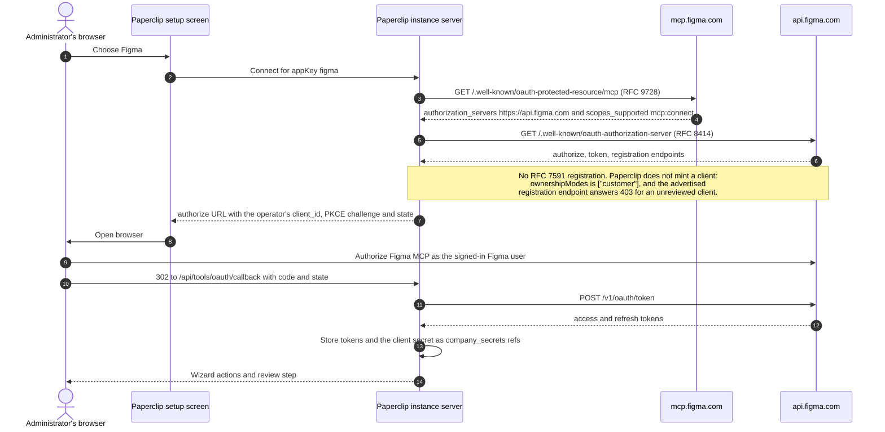

# Figma connection

Shipped shape: one curated `AppDefinition`
(`packages/shared/src/app-definitions/figma.json`) pointing directly at Figma's
own hosted remote MCP server. No shim, no wrapper, no plugin.

Two things dominate this document. **Read the seat-tier trap first** — it is the
most common way a Figma connection appears to work and delivers nothing. Then
read **Dynamic registration is refused**, which is why this connector cannot
self-provision a client at all.

- Verified against live metadata on 2026-09-30.
- Ledger row: `packages/shared/src/self-serve-mcp-research.json`, wave 3,
  `status: self_serve`, `authMode: customer_oauth`, `riskTier: S3`.

## What ships

| Field | Value |
| --- | --- |
| Method key | `mcp-oauth` |
| Label | Sign in with Figma |
| Transport | `mcp_remote` |
| Endpoint | `https://mcp.figma.com/mcp` |
| Auth | `oauth` |
| `ownershipModes` | `["customer"]` — see **Dynamic registration is refused** |
| `grantKinds` | `["user"]` |
| `defaults.scopesHint` | `["mcp:connect"]` |
| `riskTier` | `S3` |
| `requiredResourceFilters` | `["team", "project", "file"]` |
| `defaults.metadataUrl` / `discoveryUrl` / `authorizationEndpoint` / `tokenEndpoint` | **none — discovery is left to the broker** |

App-level: `slug: figma`, `categories: ["content"]`,
`redirectConstraints: "https-or-loopback-http"`,
`docsUrl: https://developers.figma.com/docs/figma-mcp-server/`,
`urlPatterns: ["https://mcp.figma.com/*"]`,
`setupPrerequisite: "A seat that can actually use MCP"`.
`consoleLinks` point at `https://developers.figma.com/docs/rest-api/oauth-apps/`,
`https://www.figma.com/settings`, and the MCP guide. Artwork:
`/brands/apps/figma.svg`, used on both themes.

## The seat-tier trap

**Figma caps MCP by seat and plan, not by plan alone.** A connection made from
the wrong seat connects cleanly, reports healthy, lists tools, and then returns
almost nothing. This is the single most important thing to know before
connecting.

Figma's published limits, from
[Rate limits & access](https://developers.figma.com/docs/figma-mcp-server/rate-limits-access/)
(read 2026-09-30). This is the page the shipped copy is written against:

| Seat | Starter | Professional | Organization | Enterprise |
| --- | --- | --- | --- | --- |
| View, Collab | Up to 20/month | Up to 6/month | Up to 6/month | Up to 6/month |
| Dev, Full | Up to 200/day, 10/min | Up to 200/day, 15/min | Up to 600/day, 20/min | *(cell empty on the page)* |

Education plans behave like Dev/Full on Professional: up to 200/day, 10/min.

Three operational consequences:

1. A View or Collab seat gets **6 read tool calls a month** on a paid plan and
   20 on Starter. That is a working demo, not a working connection. Paperclip
   surfaces this as the method warning *and* as the app's setup prerequisite,
   because a wrong-seat connection fails quietly rather than loudly.
2. Limits attach to **the seat on the team that owns the file**, not to your
   account overall. Being a Full seat on another team does not raise the limit
   for this project.
3. Limits apply to tools that **read** data from Figma. Tools that write to
   Figma files are exempt. A connection that mostly writes will appear to work
   while reads quietly stop.

Check before connecting: **Figma → Settings → Seat type**, on the person who
will sign in. Figma's `whoami` tool is exempt from rate limits, so it is a cheap
way to confirm who the connection is acting as.

> **Figma's two sources disagree, and the shipped copy says which it follows.**
> The developer rate-limits page above says View/Collab on **Starter is up to
> 20/month**, and its own "What if I'm rate-limited?" list repeats 20 for
> Starter. Figma's [`mcp-server-guide`](https://github.com/figma/mcp-server-guide)
> README says "Users on the Starter plan or with View or Collab seats on paid
> plans will be limited to up to 6 tool calls per month". The same
> rate-limits page is also internally inconsistent about Dev/Full: the table
> prints **600/day under Organization** and leaves Enterprise blank, while the
> list underneath attributes 200/day to Organization and 600/day to Enterprise.
> **The shipped prerequisite text follows the developer rate-limits page** and
> quotes its table as published. The 6/month figures from `mcp-server-guide`
> still stand as Figma's own published statement, so treat the Starter and
> Enterprise Dev/Full numbers as unsettled rather than as one truth. The
> Professional, Organization View/Collab, and Organization Dev/Full numbers are
> the ones both sources agree on.

## Dynamic registration is refused — measured, not inferred

This is the reason `ownershipModes` is `["customer"]`, and it is a measurement
rather than a reading of Figma's documentation. Figma's AS metadata advertises
`registration_endpoint: https://api.figma.com/v1/oauth/mcp/register`. That
endpoint answers **403 Forbidden**:

| Request | Result |
| --- | --- |
| `POST https://api.figma.com/v1/oauth/mcp/register` — full JSON body, `application_type: "web"` | `403 Forbidden` |
| `POST https://api.figma.com/v1/oauth/mcp/register` — full JSON body, `application_type: "native"` | `403 Forbidden` |
| `POST https://api.figma.com/v1/oauth/mcp/register` — minimal JSON body | `403 Forbidden` |
| `POST https://api.figma.com/v1/oauth/mcp/register` — form-encoded body | `403 Forbidden` |
| `POST https://api.figma.com/v1/oauth/register` | `404` |

Measured 2026-09-30. For contrast, the same request shape succeeds against the
other connectors in this change set: `POST https://console-backend.apify.com/oauth/apps`
answers `201`, and `POST https://auth.exa.ai/api/oauth/register` answers `201`
with `token_endpoint_auth_method: "none"`.

So RFC 7591 dynamic client registration **does not work** on Figma for a client
that Figma has not reviewed. What Paperclip does with that:

- The method ships `ownershipModes: ["customer"]`. `canRegisterOAuthClientDynamically`
  only allows a gallery method to mint client material when it lists `dcr`, so
  Paperclip never attempts a registration that Figma will refuse.
- The operator supplies the client: either a client ID and secret in the connect
  form (`acceptsCustomerOAuthClient` is what lets a `customer` method accept
  them), or deployment-preconfigured `PAPERCLIP_TOOL_OAUTH_FIGMA_CLIENT_ID` /
  `_SECRET`, which always win when set.
- Without either, `startOAuth` fails fast with
  `422 oauth_client_registration_unavailable` ("OAuth client id is not
  configured for api.figma.com"). That is the honest failure. Shipping `dcr`
  here would instead send the default operator down a path that ends in
  `502 oauth_dynamic_client_registration_failed`.
- The method warning states the refusal and names the probed URL, so nobody
  re-derives it at 2 a.m.

## Client allowlisting — the real open risk

Figma publishes contradictory guidance about who may connect, and the stricter
reading is the one that affects this connector:

- `developers.figma.com/docs/figma-mcp-server/` and its rate-limits page: "Only
  clients listed in the Figma MCP Catalog are able to connect to the Figma MCP
  Server. If you're a developer interested in connecting a new MCP client, you
  can join the waitlist."
- `developers.figma.com/docs/figma-mcp-server/remote-server-installation/`: "Only
  clients listed in the Figma MCP Catalog like VS Code, Cursor, or Claude Code
  can connect to the Figma MCP Server."
- `figma.com/mcp-catalog/`: "Submit your app for review — If you're looking to
  connect the Figma remote MCP server to your MCP client, you can apply to
  register your client for remote access, please reach out to your account team."
- Figma Forum, answered by Figma staff on 2026-02-06: "At the moment, the
  `mcp:connect` scope isn't available for general third-party OAuth apps — MCP
  access is currently limited to supported clients and integrations."
- `help.figma.com` "Guide to the Figma MCP server": "The remote server is
  available on all seats and plans."

Read together: seat and plan availability is broad, but **client** eligibility is
narrow and gated by Figma. The MCP endpoint and the OAuth metadata are fully
standards-compliant, so Paperclip's discovery path runs. That does **not** mean
Figma will issue a usable token to a client it has not reviewed.

**What is now measured, and what is still not.** Whether a *Paperclip-registered*
client is eligible is no longer open: the registration endpoint refuses it with
403, so a Paperclip-registered client does not exist. Whether a
*customer-registered* app can obtain a token is **UNVERIFIED** — that requires a
client Figma has reviewed (a catalog entry, or an application through Figma's
account team), which research did not have. Assume the customer path works and
prove it with a live account before treating this connector as generally
available.

If consent is refused, or the connection authenticates and then every tool call
fails, the allowlist is the first thing to suspect. Do not respond by widening
scopes.

## Connect and use

1. Get a Figma-reviewed OAuth client ID and secret. This is the blocking step:
   Figma refuses dynamic registration, so there is nothing to connect without
   one.
2. Check the signing-in person's seat type.
3. Open **Apps → Browse → Figma**, then **Connect**, and enter the client ID and
   secret.
4. Sign in with the Figma account whose files agents should read.
5. Land on the connection's Permissions screen and review the discovered actions.

Setup is **Access → Connect**. Successful authentication and catalog discovery
complete setup.

## Service involvement

Figma hosts the MCP resource at `mcp.figma.com` and its authorization server at
`api.figma.com`. Paperclip discovers the endpoints, uses the operator's
Figma-reviewed client — it does **not** register one, because Figma refuses RFC
7591 registration for an unreviewed client — stores the client secret and returned
tokens as instance-vault secret references, and handles the callback at
`/api/tools/oauth/callback`. **Neither Paperclip ID nor Paperclip Connect
participates.**

Live discovery on 2026-09-30 resolves on the **first** candidate. That is why the
manifest ships no `metadataUrl`: a hint would only add a second source of truth to
keep in step with Figma.

| Role | Endpoint |
| --- | --- |
| MCP server | `https://mcp.figma.com/mcp` |
| Protected-resource metadata (RFC 9728) | `https://mcp.figma.com/.well-known/oauth-protected-resource/mcp` |
| AS metadata (RFC 8414) | `https://api.figma.com/.well-known/oauth-authorization-server` |
| Authorize | `https://www.figma.com/oauth/mcp` |
| Token (exchange + refresh) | `https://api.figma.com/v1/oauth/token` |
| Registration (RFC 7591 DCR) | `https://api.figma.com/v1/oauth/mcp/register` — **advertised but refused with 403** |
| Paperclip callback | `/api/tools/oauth/callback` |

Observed metadata facts: `issuer: https://api.figma.com`,
`scopes_supported: ["mcp:connect"]`, `bearer_methods_supported: ["header"]`,
`resource_name: "Figma MCP"`, `code_challenge_methods_supported: ["S256"]`,
`require_state_parameter: true`, `authorization_response_iss_parameter_supported: true`,
`grant_types_supported: ["authorization_code", "refresh_token", "urn:ietf:params:oauth:grant-type:jwt-bearer"]`,
`authorization_grant_profiles_supported: ["urn:ietf:params:oauth:grant-profile:id-jag"]`.

No `revocation_endpoint` is advertised and no CIMD support is advertised. Note
also that `GET https://mcp.figma.com/mcp` returns `405 Method not allowed`
rather than a `401` challenge; the RFC 9728 document is what makes discovery
work, and it is served at both the path-aware and origin forms.

## The client is confidential, and it is yours

`token_endpoint_auth_methods_supported` is exactly
`["client_secret_basic", "client_secret_post"]`. **There is no public-client
method**, so whichever client signs in — registered or customer-owned — is a
*confidential* client. Figma issues a `client_secret`, and Paperclip stores it as
an encrypted `oauth.client_secret` secret reference. That is expected and normal;
it is not an error to chase.

The practical consequences:

- The operator needs a Figma-reviewed OAuth app: a client ID and secret, with
  Paperclip's redirect URI registered against it. Where that comes from is
  Figma's side — the [MCP Catalog](https://www.figma.com/mcp-catalog/) or an
  application through the account team — not something Paperclip can mint.
- Losing the secret means reconnecting with the client ID and secret again.
- `ownershipModes` is `["customer"]`, not `["dcr", "customer"]`. Both modes in one
  list would leave `dcr` selectable and send a default operator into a refused
  registration, so `dcr` is removed outright. Deployment-preconfigured
  `PAPERCLIP_TOOL_OAUTH_FIGMA_CLIENT_ID` / `_SECRET` values always take
  precedence when set.
- Do not "fix" the confidential-client behavior by pinning
  `authorizationEndpoint` and `tokenEndpoint` in the manifest. A complete pair
  makes `oauthEndpointsForConnection` skip discovery entirely, which also drops
  the discovery result's `registration_endpoint`.

## The identity consequence — read this plainly

`grantKinds: ["user"]` means the remote MCP server acts as **the signed-in Figma
user**. An agent therefore reads exactly the files that human can already open,
rather than reading through a shared bot account.

That is a deliberate safety property: Figma's permission model is per-user, and a
delegated-human identity cannot accidentally exceed what its owner can see. It
also means:

- **The connection inherits that person's visibility.** Private projects, drafts,
  and files they can open are readable by every agent granted the connection.
  Revoke the connection or remove the grant when that person leaves, or when you no
  longer want an agent acting as them.
- **Attribution follows the human.** Reads and any writes appear in Figma's
  history as that user.
- **It is not a service identity.** There is no way to give an agent a narrower
  Figma identity than "this person", and no shared account to rotate.

## Resource filters

`requiredResourceFilters: ["team", "project", "file"]`.

These are reviewed policy metadata, not enforcement. The real boundary is the
signed-in Figma user's own visibility plus the action policy you apply. Use them
to express intent and to guide post-setup narrowing, not as an allowlist.

## Governance defaults

`riskTier: S3`. Under `recommendedDefaultsForApp` every active action starts
**Allowed**, including writes. For Figma that means design-system and comment
mutations are permitted until you narrow them. Set **Ask first** or **Off** on
write actions in the connection's Permissions screen before granting a
connection broadly, and expect write actions to be quota-exempt in a way reads
are not.

## Recovery

- `422 oauth_client_registration_unavailable` ("OAuth client id is not configured
  for api.figma.com") on sign-in: expected. Figma refuses dynamic registration,
  so the connection needs a Figma-reviewed client ID and secret. Enter them in the
  connect form or set `PAPERCLIP_TOOL_OAUTH_FIGMA_CLIENT_ID` / `_SECRET`.
- Connection is healthy but an agent gets nothing: check the signing-in person's
  seat type first, then Figma's rate-limit state. This is the documented failure
  mode, not a credential problem.
- Tools list but calls are refused: suspect the client allowlist before scopes.
  The token authenticated, so the scope is in hand; what Figma gates is the
  client.
- `invalid_client` after a reconnect: the confidential client secret is gone or
  no longer matches the client ID. Re-enter both.
- Connection stays unhealthy after an Figma-side change: refresh the catalog, and
  if Figma removed the seat or revoked access, reconnect.

## Validation boundary

Deterministic coverage exists for the catalog contract, URL recognition, the
absence of pinned endpoints and metadata hints, the single-user grant kind, the
single reviewed scope, the refusal warning, and the seat-limit prerequisite text
(`packages/shared/src/app-definitions.test.ts`).

Explicitly **UNVERIFIED**:

- **Whether a customer-registered Figma app can obtain a token at all.** The
  registration endpoint is refused for an unreviewed client (403, measured), so
  the only remaining question needs a client Figma has reviewed. Research had
  none. Everything else on this connector — discovery, the authorization request,
  the token exchange — is unproven end to end until one live account completes it.
- **The Starter View/Collab figure and the Enterprise Dev/Full figure**, for the
  reason recorded in the seat-tier section: Figma's own sources disagree.
- Full lifecycle proof: consent, catalog, one safe read, refresh, revoke, secret
  scan.