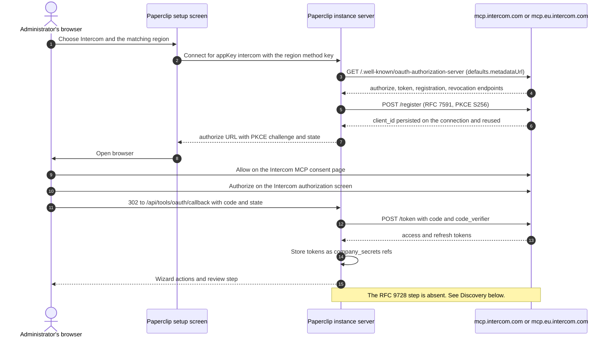

# Intercom connection

Shipped shape: one curated `AppDefinition` (`packages/shared/src/app-definitions/intercom.json`)
pointing directly at Intercom's own hosted remote MCP server. No shim, no
wrapper, no plugin.

Read the **Discovery** section before changing anything about this connector.
Intercom's OAuth metadata is unusual, and the manifest works around it in a way
that looks wrong until you know why.

- Verified against live metadata on 2026-09-30.
- Ledger row: `packages/shared/src/self-serve-mcp-research.json`, wave 2,
  `status: self_serve`, `authMode: dcr`, `riskTier: S3`.

## What ships

| | US method | EU method |
| --- | --- | --- |
| Method key | `mcp-oauth-us` | `mcp-oauth-eu` |
| Label | US hosted workspace | EU hosted workspace |
| Transport | `mcp_remote` | `mcp_remote` |
| Auth | `oauth` | `oauth` |
| `ownershipModes` | `["dcr"]` | `["dcr"]` |
| MCP endpoint | `https://mcp.intercom.com/mcp` | `https://mcp.eu.intercom.com/mcp` |
| `defaults.metadataUrl` | `https://mcp.intercom.com/.well-known/oauth-authorization-server` | `https://mcp.eu.intercom.com/.well-known/oauth-authorization-server` |
| `riskTier` | `S3` | `S3` |
| `requiredResourceFilters` | `["workspace", "inbox", "team"]` | `["workspace", "inbox", "team"]` |

Both methods carry the same `scopesHint`, copied verbatim from Intercom's own
OAuth Scopes page because Paperclip sends these strings straight through as the
OAuth `scope` parameter:

```text
Read and list users and companies
Read conversations
Write conversations
Read and Write Articles
```

An earlier revision of this connector shipped shortened and recased versions of
two of those (`"Read users and companies"`, `"Read and write articles"`). Because
Intercom advertises no `scopes_supported` to validate against, a shortened string
is not a weaker permission — it is an unknown one. The strings now match the page
that lists Intercom's selectable scopes, word for word.

App-level: `slug: intercom`, `categories: ["communication"]`, `redirectConstraints:
"https-or-loopback-http"`, `docsUrl: https://developers.intercom.com/docs/guides/mcp`,
`urlPatterns: ["https://mcp.intercom.com/*", "https://mcp.eu.intercom.com/*"]`,
`setupPrerequisite: "A US or EU hosted Intercom workspace"`. Artwork:
`/brands/apps/intercom.svg` with `/brands/apps/intercom-dark.svg` for the dark
frame.

The two methods are a real user choice, not a convenience: each host is a
separate Intercom deployment with its own issuer and its own token endpoint.
`https://mcp.au.intercom.com/mcp` is deliberately **not** matched by
`urlPatterns` and resolves to no definition, because AU hosted workspaces are not
supported by the MCP server at all.

## Connect and use

1. Open **Apps → Browse → Intercom**.
2. Pick the region. **The method Paperclip recommends by default is
   `mcp-oauth-us`.** If your workspace is at `app.eu.intercom.com`, switch to
   **EU hosted workspace** before continuing. A US endpoint cannot reach an EU
   workspace.
3. Sign in to Intercom in the browser. Intercom shows two screens in order: its
   own MCP consent page (names the requesting app, its client ID, and where it
   redirects) and then Intercom's authorization screen.
4. Read the **Redirects to** address on the consent page and confirm it is your
   Paperclip instance callback before choosing **Allow**. Intercom's
   authorization screen can only name the Intercom MCP server, so the consent
   page is the only place the requesting application is visible, and Intercom
   does not verify the name an application supplies for itself.
5. Land on the connection's Permissions screen. Every discovered action starts
   **Allowed** under the current product default. Narrow there.

Setup is **Access → Connect**. Successful authentication and catalog discovery
complete setup. Reconnect and catalog refresh preserve **Off** and **Ask first**
selections.

## Service involvement

Intercom hosts the MCP resource and its own OAuth authorization server. Paperclip
reads the RFC 8414 document, registers its own client with Intercom through
RFC 7591 DCR, stores the returned tokens as instance-vault secret references, and
handles the callback at `/api/tools/oauth/callback`. **Neither Paperclip ID nor
Paperclip Connect participates.** DCR is instance-local, and cloud-hosted and
self-hosted instances use the same path; the only per-instance difference is the
hostname inside the redirect URI.



Exact endpoints, per region. Substitute the region host consistently; the two
hosts are separate deployments.

| Role | US | EU |
| --- | --- | --- |
| MCP server | `https://mcp.intercom.com/mcp` | `https://mcp.eu.intercom.com/mcp` |
| Legacy SSE (deprecated by Intercom) | `https://mcp.intercom.com/sse` | `https://mcp.eu.intercom.com/sse` |
| AS metadata (RFC 8414, origin form) | `https://mcp.intercom.com/.well-known/oauth-authorization-server` | `https://mcp.eu.intercom.com/.well-known/oauth-authorization-server` |
| Authorize | `https://mcp.intercom.com/authorize` | `https://mcp.eu.intercom.com/authorize` |
| Token (exchange, refresh, revocation) | `https://mcp.intercom.com/token` | `https://mcp.eu.intercom.com/token` |
| Registration (RFC 7591) | `https://mcp.intercom.com/register` | `https://mcp.eu.intercom.com/register` |
| Paperclip callback | `/api/tools/oauth/callback` | same |

There is no `/revoke`; Intercom advertises `revocation_endpoint` pointing at the
token endpoint itself.

## Discovery: the reason this definition looks the way it does

Live probes on 2026-09-30, US host (EU behaves identically):

| Request | Result |
| --- | --- |
| `GET https://mcp.intercom.com/mcp` | `401`, `WWW-Authenticate: Bearer realm="OAuth", error="invalid_token", error_description="Missing or invalid access token"` |
| `GET https://mcp.intercom.com/.well-known/oauth-protected-resource/mcp` | `404` |
| `GET https://mcp.intercom.com/.well-known/oauth-protected-resource` | `404` |
| `GET https://mcp.intercom.com/.well-known/oauth-authorization-server` | `200` |

The `401` carries **no `resource_metadata` parameter**, and both RFC 9728
protected-resource document forms are gone. So `challengeOAuthHints` yields
nothing to follow, and there is no advertised authorization server to chase.
The only RFC 9728 route to an issuer is broken for this provider.

The one document that answers is the **origin-form** RFC 8414 document. Note that
it is not unreachable: `wellKnownMetadataUrls` appends the origin form
unconditionally, outside its path-aware branch
(`server/src/services/tool-access.ts:551`), so for `https://mcp.intercom.com/mcp`
the derived candidates are

| Order | Derived candidate | Result |
| --- | --- | --- |
| 1 | `/.well-known/oauth-authorization-server/mcp` (path-aware, RFC 8414 §3) | `404` |
| 2 | `/mcp/.well-known/oauth-authorization-server` (widely deployed) | `401` |
| 3 | `/.well-known/oauth-authorization-server` (origin form) | `200` |

(All three measured 2026-09-30. Candidate 2's `401` is not `ok`, so
`preflightGalleryAppMetadata` skips it the same way it skips a `404`.)

So the standard chain *does* eventually land on the right document, after two
failed probes. Naming it explicitly through `defaults.metadataUrl` is still
load-bearing, for two reasons:

- It is asked for **first**, so the preflight stops at the correct document
  instead of spending two failed probes per region per connect.
- `oauthProviderEndpoints` (`server/src/services/tool-access.ts:9036`) refuses to
  resolve any endpoint at all when neither an authorization endpoint, a token
  endpoint, nor a `metadataUrl` is available. It throws
  `OAuth provider endpoints are not configured for this app` otherwise. Without
  the `metadataUrl` key, this provider cannot sign in at all — the derived
  candidates above feed the *preflight*, not the connect path.

`preflightGalleryAppMetadata` (`server/src/services/tool-access.ts:16625`) seeds
its queue with `defaults.discoveryUrl`, then `defaults.metadataUrl`, then the
derived `protectedResourceMetadataUrls(...)` and `wellKnownMetadataUrls(...)`
candidates. The named document is therefore asked for before any derived
candidate.

### Why a fixed `authorizationEndpoint` + `tokenEndpoint` pair would be worse

Do not "fix" this by pinning the endpoints. `oauthEndpointsForConnection`
(`server/src/services/tool-access.ts:9087`) treats a gallery method that carries
**both** endpoints as authoritative and skips `discoverOAuthEndpoints`
entirely — including the discovery result's `registration_endpoint`. With no
registration endpoint there is nothing for RFC 7591 DCR to register against, so
the automatic path dies even though authorize and token are known.

Both regions ship the metadata URL. Neither ships the pair. `app-definitions.test.ts`
pins both facts, plus the negative case that each region's hint lives on that
region's own host.

## Credentials and ownership

- `ownershipModes: ["dcr"]`. Paperclip registers its own client with Intercom on
  first connect. There is no Intercom-side app for an administrator to create,
  and no Paperclip approval to obtain.
- Intercom's AS metadata advertises
  `token_endpoint_auth_methods_supported: ["client_secret_basic", "client_secret_post", "none"]`,
  so the registered client is a public client and Paperclip expects no client
  secret.
- Tokens land as `oauth.access_token` and `oauth.refresh_token` refs in the
  instance vault. Nothing is written into agent, project, or runtime
  environment values, connection config, comments, or logs.
- `redirectConstraints: "https-or-loopback-http"`. Use a public HTTPS Paperclip
  origin or a loopback HTTP origin such as `http://localhost:3100`. A plain-HTTP
  non-loopback origin fails fast with `oauth_redirect_origin_unsupported` rather
  than a confusing provider-side `invalid_redirect_uri`.
- If `Allow` shows **"Authorization could not be completed"**, the consent page
  expired. Intercom's consent page lives 15 minutes.
- Only one connection can be pending per browser. Starting a second OAuth
  attempt in another tab before finishing the first makes the first tab's
  `Allow` fail the same way.

## Resource filters

`requiredResourceFilters: ["workspace", "inbox", "team"]` on both methods.

Per the connector playbook, this is reviewed policy metadata, not an enforcement
boundary. The real boundary is the Intercom account the signed-in administrator
belongs to plus the action policy you apply. In particular:

- The token acts as the **signing-in Intercom admin**, not as a shared bot
  account. It sees exactly what that person sees, and writes are attributed to
  that person. Intercom attributes an internal note to the admin who authorized
  the MCP connection; authorship cannot be set per call.
- An inbox or team filter narrows what an operator *intends*, but it does not
  stop the token from reaching other inboxes in the same workspace.

## Capabilities and traps

Intercom's documentation lists **14 tools**. Classified at the shape level:

| Group | Tools | Class |
| --- | --- | --- |
| Universal search/fetch | `search`, `fetch` | read |
| Conversations | `search_conversations`, `get_conversation` | read |
| Contacts and companies | `search_contacts`, `get_contact`, `list_companies`, `get_company` | read |
| Help Center articles | `list_articles`, `search_articles`, `get_article` | read |
| Help Center writes | `create_article`, `update_article` | write |
| Internal notes | `add_internal_note` | write |

Two things an operator must know before connecting:

1. **This connection cannot message a customer.** `add_internal_note` is the
   only conversation-side write and Intercom states plainly that it is visible to
   teammates only — it cannot send customer-visible replies. Do not promise an
   agent "reply to the customer" on this connection.
2. **A `401` from `add_internal_note` usually means a stale authorization, not a
   bad password.** Intercom documents that a `401` here most often means the
   workspace's Intercom connection predates the **Write conversations**
   permission. Disconnect and reconnect the Intercom integration to grant it.

`add_internal_note` also has one non-obvious side effect: adding a note to a
conversation that is snoozed and assigned to someone other than the authorizing
admin **unsnoozes (reopens)** it.

## Provider evidence and unverified items

Verified on 2026-09-30 from live public metadata and Intercom's own MCP guide at
`https://developers.intercom.com/docs/guides/mcp`:

- Both regional endpoints, both 14-tool inventories, the deprecated `/sse`
  paths, US/EU regional data hosting, and AU being unsupported.
- The discovery table above.
- AS metadata on both hosts: issuer equal to the host, `authorization_endpoint`
  `/authorize`, `token_endpoint` `/token`, `registration_endpoint` `/register`,
  `revocation_endpoint` `/token`, `grant_types_supported`
  `["authorization_code", "refresh_token"]`, `response_types_supported: ["code"]`,
  `response_modes_supported: ["query"]`, `code_challenge_methods_supported: ["S256"]`.

Explicitly **UNVERIFIED**:

- **The exact wire form of the scope strings.** `scopesHint` now holds Intercom's
  own strings from its OAuth Scopes page
  (`https://developers.intercom.com/docs/build-an-integration/learn-more/authentication/oauth-scopes`),
  which is the list Intercom offers as Developer Hub checkboxes, and Intercom's AS
  metadata advertises **no `scopes_supported` at all** (confirmed on both hosts
  2026-09-30), so nothing validates them on the wire. Intercom's own two pages do
  not agree on one of them: the OAuth Scopes page writes **"Read and Write
  Articles"** while the MCP guide's "Required Scopes" section writes **"Read and
  write articles"**. The manifest follows the OAuth Scopes page. **Only a live
  token confirms which form Intercom accepts**, and a successful consent screen
  naming the expected permissions is the check. Treat a consent screen that shows
  fewer permissions than expected as the signal that the string was wrong — do not
  respond by widening it.
- **Whether Intercom honours the `scope` parameter at all.** The consent screen
  summarizes the permissions as three sentences ("view conversations and add
  internal notes to them, view contacts and companies, and view, create and
  update articles") rather than echoing requested scopes, which is consistent
  with Intercom deriving permissions from the registered client instead.
- **DCR end to end.** No client was registered during research, per the
  playbook. That `POST /register` succeeds with a PKCE S256 public client, and
  that the full consent → callback → token → catalog → read lifecycle completes,
  still needs a live account proof.

### Corporate-status note — dated data, cheap to revise

Salesforce announced on 2026-06-15 a definitive agreement to acquire Fin,
formerly Intercom, for approximately $3.6 billion, expected to close in the
fourth quarter of Salesforce's fiscal 2027 subject to regulatory clearances.
This is stated by Salesforce's own newsroom and by Intercom's own blog, so the
announcement itself is not merely marketing copy.

**Whether the transaction has closed is UNVERIFIED** as of 2026-09-30, and so is
what a close would mean for these endpoints, this OAuth surface, and the
`intercom` brand asset. Treat the whole manifest as dated data. It is cheap to
revise: endpoints, the metadata hint, and the artwork are four edits in
`scripts/ingest-app-definitions.mjs` followed by
`pnpm connections:ingest-app-definitions`.

## Recovery

- Cancelled or expired consent: start the connect flow again. A cancelled
  callback state cannot be reused.
- "Invalid redirect URI ... does not match any registered URI for this client":
  the client opened its callback on a port it never registered. Clear the
  saved authorization for `mcp.intercom.com` in the connecting client and
  reconnect so the client registers its current callback address.
- `401` on `add_internal_note` only: reconnect to pick up the **Write
  conversations** permission.
- Wrong region: a US token cannot read an EU workspace. Disconnect and connect
  the matching method rather than editing the stored endpoint.
- Connection looks healthy but tools return nothing: confirm the signing-in
  administrator actually belongs to the workspace and can see the target inbox
  or team.

## Validation boundary

Deterministic coverage exists for the catalog contract, regional URL
recognition, the reviewed scope strings, the metadata-hint requirement and the
no-endpoint-pair invariant, and the preflight queue order
(`packages/shared/src/app-definitions.test.ts`,
`server/src/__tests__/tool-access-service.test.ts`). Those fixtures serve the
metadata at the exact hinted URL and 404 every derived candidate, so they fail if
the hint is dropped or stops being read. They are **not** evidence that a live
Intercom account connected, and pinning a scope string is not evidence that
Intercom accepts it — the strings are pinned against Intercom's documentation
precisely because the wire form still needs a live token. Full lifecycle proof
for both methods — consent, catalog, one safe read, refresh, revoke, secret scan —
remains outstanding.